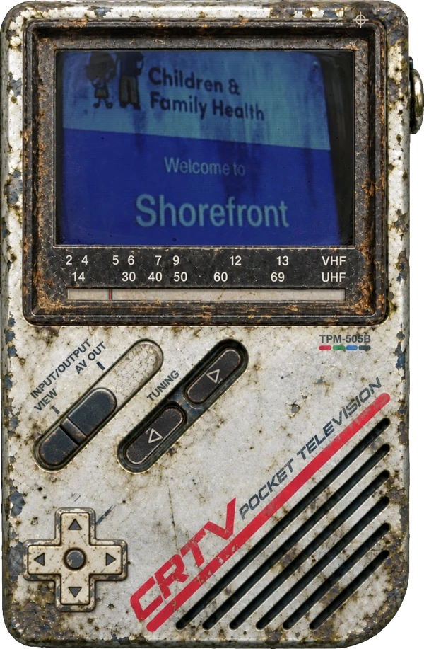
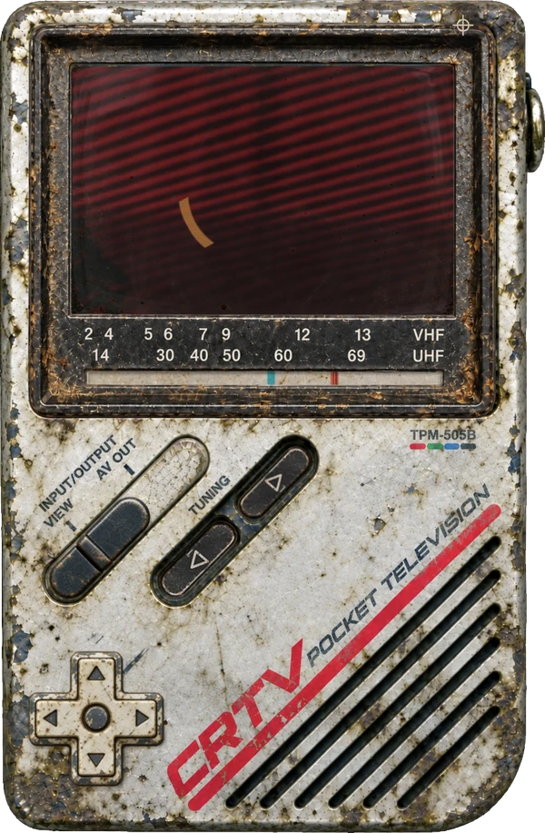
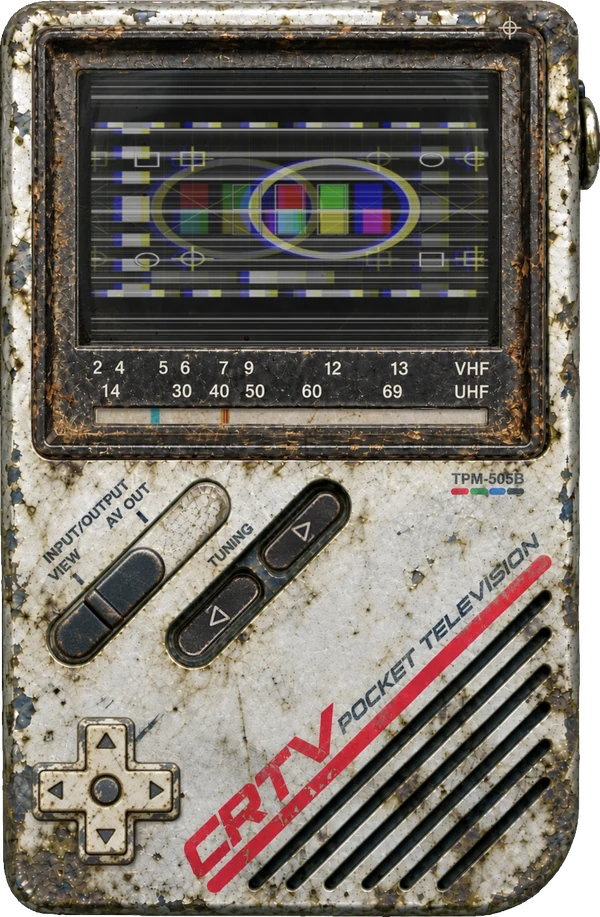

# Silent Hill Townfall Companion


**Townfall Companion turns your phone into the CRTV handheld scanner from SILENT HILL: Townfall.**
Your phone's browser shows the CRTV with a live feed from the game; you control it with the tuning buttons and the
D-pad. No phone app is needed: the page runs from your PC over your home network.

The mod doesn't rebuild the CRTV's screen and sound from game files: both are streamed live from the running game.
You only need to install [UE4SS for SILENT HILL Townfall](https://www.nexusmods.com/silenthilltownfall/mods/4) and
Python.

The mod is also available on **[Nexus Mods](https://www.nexusmods.com/silenthilltownfall/mods/125)**.

## Features

- **VIEW mode** - the CRTV is on your phone. You can tune it the same way you would on the keyboard or controller.
- **AV OUT mode** - the CRTV stays on your PC screen.
- **CRTV fine tuning** - supported, I hope: tune with the D-pad and the phone's gyroscope.
- **Monster scanner** - while scanning, you can turn the phone on its own, without moving the character.
- **Auto Pickup** - picking the phone up switches to VIEW; laying it flat or setting it on a stand switches to
  AV OUT, like putting the CRTV away when you're not using it.

Many features can be changed in the settings, found in the phone "app" in the top-right corner.

| CRTV video | Monster signal | Fine tuning |
| --- | --- | --- |
|  |  |  |

## Requirements

- **SILENT HILL: Townfall** on Steam, Windows. Tested on Steam build 25697972.
- **[UE4SS for SILENT HILL Townfall](https://www.nexusmods.com/silenthilltownfall/mods/4)** by AeonGreyh. The UE4SS
  releases on GitHub crash this game; this package has the fix.
- **[Python](https://www.python.org/downloads/) 3.10 or newer.** Nothing else: the Companion uses only what comes
  with Python.
- A phone on the same Wi-Fi as the PC: Android with Chrome is recommended, an iPhone works with
  [limitations](docs/PHONE_SETUP.md#3-iphone).

## Installation

1. Install [UE4SS for SILENT HILL Townfall](https://www.nexusmods.com/silenthilltownfall/mods/4) into
   `Townfall\Binaries\Win64`.
2. Install [Python](https://www.python.org/downloads/) 3.10 or newer. During installation, make sure
   **"Add python.exe to PATH"** is enabled.
3. Download the latest release from
   [Releases](https://github.com/smaugikun/silent-hill-townfall-companion/releases/latest). Open
   `Townfall\Binaries\Win64\ue4ss\Mods` and copy the **`TownfallCompanion`** folder from that download into it.
   `enabled.txt` must be directly in `Mods\TownfallCompanion\`, not one folder deeper.
4. Double-click **`Start Companion.py`**; it runs with the Python you installed. *(Or open Command Prompt in the
   TownfallCompanion folder and type: `py "Start Companion.py"`)*
5. Keep its window open while you play; *it closes by itself about a minute after you exit the game.* If Windows
   Firewall asks, allow Python.
6. The Companion's window shows the address for the phone's browser, e.g. `http://192.168.1.50:8790`, with a QR
   code to scan, and a **PIN**. It also checks that the phone can reach the PC, and says what to change if it can't.
7. On your phone (on the same Wi-Fi), open that address or scan the QR code, enter the PIN, then tap the screen once
   to enable sound and full screen. Then start the game. The phone shows WAITING FOR GAME until you are in gameplay
   (after loading a save).

**Android is recommended** for looking around, for fine tuning, for Auto Pickup and for keeping the
screen on: open `chrome://flags/#unsafely-treat-insecure-origin-as-secure`, set **Insecure origins treated as
secure** to Enabled, enter the Companion's address with its port (for example: `http://192.168.1.50:8790`) in the
field that appears, then relaunch Chrome ([Phone setup](docs/PHONE_SETUP.md)). iPhone works with limitations (no
motion controls, no vibration, and the screen can't be kept on).

**Updating:** close the Companion and the game, delete the `Scripts` and `companion` folders in TownfallCompanion,
and extract the new version over it. Your settings remain. If you're coming from 1.x, the `tools` and `cache`
folders aren't used any more and can be deleted.

**After a game update** there is nothing to do: the Companion reads the game's new version by itself the next time
it starts.

**Uninstalling:** delete `...\ue4ss\Mods\TownfallCompanion`.

## Troubleshooting

- **The phone can't open the page:** the Companion's window checks the way from the phone to the PC step by step and
  says what to change: [The page doesn't open](docs/TROUBLESHOOTING.md#the-page-doesnt-open-or-keeps-saying-connection-lost).
- **WAITING FOR GAME:** get into gameplay, and check that `ue4ss\UE4SS.log` has
  `[TF-COMPANION] Townfall Companion loaded`.
- **Static instead of the CRTV's screen:**
  [The phone shows static](docs/TROUBLESHOOTING.md#the-phone-shows-static-instead-of-the-crtvs-screen).
- **No sound:** tap the phone once and keep its screen on. Settings → *Status* → *Sound* says whether the game's
  sound comes through.
- **PIN forgotten:** it is in the Companion's window and as `pin` in `companion.ini`.

More: [Troubleshooting](docs/TROUBLESHOOTING.md) · [Phone setup](docs/PHONE_SETUP.md)

## Good to know

**This is my first mod, and it is still close to a proof of concept.** I haven't played through the whole game with
it, so I can't promise everything works throughout.

The PIN keeps others on your network out of the page, but it isn't encryption: use the Companion on your home network
only.

I used AI for major parts of the mod (mostly the code, and some graphical assets). If you're against using AI, this
mod might not be for you.

## Building from source

The release zip comes ready to use. To build it yourself (Windows, Python 3.10 or newer; Node.js 22 or newer for the
phone page's tests):

```
py -m pip install -r requirements-dev.txt
py native/build.py
py -m unittest discover -s tests
node --test tests/*.test.mjs
py tools/package.py
```

`native/build.py` compiles `tf_native.dll`, the part that takes the CRTV's picture and sound from the running game,
from `native/` with Zig. `tools/package.py` builds `dist/TownfallCompanion-<version>.zip` from the last commit and
that DLL. What the DLL does, and what it doesn't: [docs/NATIVE_DLL.md](docs/NATIVE_DLL.md).

## Credits

Townfall Companion by smaugikun
([source on GitHub](https://github.com/smaugikun/silent-hill-townfall-companion)), open source under the
[MIT License](LICENSE). MinHook by Tsuda Kageyu, built into the mod's DLL. UE4SS by the UE4SS-RE Team and contributors
([RE-UE4SS](https://github.com/UE4SS-RE/RE-UE4SS)); its Townfall package and signature by Aeon Greyh. More in
[Third-party notices](THIRD_PARTY_NOTICES.md).

SILENT HILL is a trademark of KONAMI. This is an unofficial fan mod, not affiliated with or endorsed by KONAMI or the
developers or publishers of SILENT HILL: Townfall.
