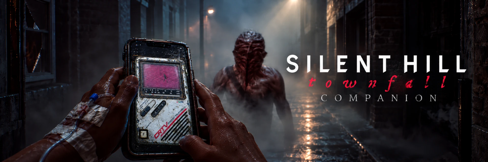
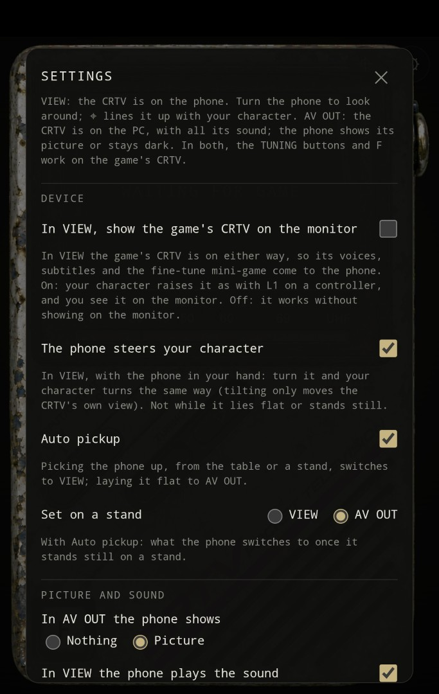
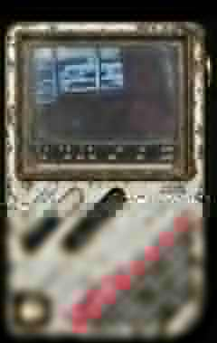

# Townfall Companion



Your phone becomes the CRTV, the handheld TV scanner from **SILENT HILL: Townfall**: it shows what the CRTV
shows and plays its sound and the signals' voices, and it can tune it and turn your character as if you were
holding it. The phone needs no app, only its browser.

Also on **[Nexus Mods](https://www.nexusmods.com/silenthilltownfall/mods/125)**, where the install archive is downloaded.

- **A CRTV in your hand:** the device with its screen, dial, AV OUT / VIEW switch, TUNING buttons and F key (save / confirm frequency).
- **VIEW:** the CRTV is on the phone. It finds the monsters and signals from the game, shows them on its dial
  and screen with their videos, and plays the CRTV's sound and the voices; turning the phone turns the
  scanner's view, up and down too. Its TUNING buttons tune the game's CRTV as well, so it comes up where the
  phone left it, and while that one is up the phone shows it, the fine-tune mini-game included, and F
  saves / confirms the tuned frequency. The monsters on the phone are an interpretation; the game's models are not
  included.
- **In VIEW, switch on the game's CRTV** (optional, off by default): your character raises the CRTV as with L1
  on a controller, and the signals' voices, the subtitles and the fine-tune mini-game work.
- **AV OUT:** the CRTV is on the PC, with all its sound; the phone mirrors the picture or stays dark, and its
  buttons still tune, and F saves / confirms the frequency.
- **The phone steers your character** (optional, off by default): in VIEW, turning the phone turns your
  character left/right. After about **4 seconds completely still**, steering rests; pick up or move the phone
  again and it activates automatically. Phone tilt still changes the scanner view, but does not take over
  Townfall's vertical game camera.
- **Auto pickup** (optional): switches to VIEW when the phone is picked up (from the table or a stand) and to
  AV OUT when it is laid flat; set on a stand, it stays in VIEW or goes to AV OUT, as chosen.
- **Pause:** in the game's pause menu, everything on the phone holds too.
- Vibration for the buttons and nearby signals, and settings for every part of it.

## Screenshots

| Settings | CRTV video | Monster scanner |
| --- | --- | --- |
|  |  |  |

## The game's sound and videos

The mod contains no files from the game. The companion takes the sound and videos from your own copy of the
game, on your PC, and streams them to the phone over your home network:

- **Sound:** the CRTV's sounds, the signals' voices and the cutscenes' dialogue are decoded from the game's
  FMOD sound banks with vgmstream the first time the phone needs them, and kept in
  `TownfallCompanion\cache\sounds`.
- **Videos:** no manual conversion step is required before playing. As soon as the companion starts, it begins converting all missing videos to small phone MP4s in the background and
  keeps them in `TownfallCompanion\cache\clips`. If you reach a clip before the background job gets to it,
  that one converts immediately on request as a fallback. `Convert Game Videos.bat` is only a manual pre-cache shortcut: run it beforehand if you want every
  video cached before the game starts, so no conversion runs during play.
  RAD runs hidden in the background using its reliable Bink-to-AVI path; FFmpeg immediately makes the small
  cached MP4 and the temporary AVI is deleted. Closing the companion also stops an active conversion. On the
  next start, completed MP4s are skipped and conversion continues with whatever is still missing.
  Without the video tools, the phone shows static, or its own drawn picture for a monster, where the CRTV plays a video, and the
  videos on screens in cutscenes don't appear on the phone; the videos' sound then plays on the PC.

## Requirements

- **[UE4SS for SILENT HILL Townfall](https://www.nexusmods.com/silenthilltownfall/mods/4)** by AeonGreyh.
  UE4SS ([RE-UE4SS on GitHub](https://github.com/UE4SS-RE/RE-UE4SS)) is a scripting system for Unreal Engine
  games; it runs this mod's in-game part, which reads the CRTV, the player and the monsters and carries out the
  phone's commands. Townfall needs AeonGreyh's package: it contains a fix without which the UE4SS releases on
  GitHub crash the game. Install it into `Townfall\Binaries\Win64` as its page describes.
- **[Python](https://www.python.org/downloads/) 3.10 or newer**: runs the companion on the PC (the server the
  phone connects to, the sound decoding and the video converter). When installing, tick **"Add python.exe to
  PATH"** so the mod's `.bat` files can find it.
- **[vgmstream](https://vgmstream.org)** (`vgmstream-win64.zip`, tested with r2117): reads the game's sound
  banks. Without it, the phone is silent.
- **[RAD Video Tools](https://www.radgametools.com/bnkdown.htm)** (`RADTools.7z`,
  tested with 2026.06) and **[FFmpeg](https://www.gyan.dev/ffmpeg/builds/)** (tested with 9.0.2).
- A phone with Chrome (Android) on the same Wi-Fi as the PC. iPhones work with
  [limits](docs/PHONE_SETUP.md#3-iphone).

Tested on SILENT HILL: Townfall Steam build 25534608.

## Installation on the PC

1. Install **UE4SS for SILENT HILL Townfall** as its Nexus page says. Start the game once to check that it
   runs, then close it.
2. Install **Python**, with **"Add python.exe to PATH"** ticked.
3. Open the game's folder: in Steam, right-click SILENT HILL: Townfall → *Manage* → *Browse local files*. Go
   into `Townfall\Binaries\Win64\ue4ss\Mods` and put the mod's **`TownfallCompanion` folder** there: from the
   Nexus download, or, if you took the source from GitHub (*Code* → *Download ZIP*), the `TownfallCompanion`
   folder inside it, not the whole download. `enabled.txt` must end up directly in `Mods\TownfallCompanion\`,
   not in `Mods\TownfallCompanion\TownfallCompanion\`, or UE4SS won't load the mod:

   ```text
   ...\ue4ss\Mods\TownfallCompanion\
       enabled.txt
       Start Companion.bat
       Convert Game Videos.bat
       Scripts\
       companion\
       tools\
           vgmstream\    vgmstream-cli.exe and 11 .dll files
           radtools\     radvideo64.exe
           ffmpeg\       ffmpeg.exe
   ```

4. Put **vgmstream** (`vgmstream-win64.zip`) in `TownfallCompanion\tools\vgmstream\`. Every folder in `tools`
   has a `PUT FILES HERE.txt` that lists exactly which files must be in it and where to download them.
5. Put **RAD Video Tools** (`radvideo64.exe`) in `TownfallCompanion\tools\radtools\` and **FFmpeg**
   (`ffmpeg.exe`) in `TownfallCompanion\tools\ffmpeg\`.
   That's all you need: when the companion starts, it automatically pre-caches missing videos in the background—so it can work while Townfall is still at the splash screen or main menu. **You do not need to run `Convert Game Videos.bat`**. You can run it anyway before launching
   the game if you want every clip ready immediately and no background conversion during play.
   `RADTools.7z` is a 7-Zip archive: Windows 11 opens it (right-click → *Extract All*); on Windows 10 use
   [7-Zip](https://www.7-zip.org).
6. Double-click **`Start Companion.bat`** in `TownfallCompanion`. Each time it starts it also switches off UE4SS's
   debug console windows (`ConsoleEnabled`, `GuiConsoleEnabled` and `GuiConsoleVisible` in
   `ue4ss\UE4SS-settings.ini`), which takes effect at the next Townfall launch; `UE4SS.log` still works normally.
   To get a console back for debugging, set those three to `1` again after starting the companion. The first time,
   Windows asks whether Python may use the network: allow it on **private networks**. The window shows the address for the phone, e.g.
   `On the phone: http://192.168.1.50:8790`. Keep the window open.

## Setup on the phone

1. Connect the phone to the **same Wi-Fi** as the PC (not a guest network).
2. Open **Chrome** (Android) or **Safari** (iPhone) and enter the address from the companion's window, with the
   port, e.g. `http://192.168.1.50:8790`. Bookmark it: it stays the same as long as the PC keeps its network
   address.
3. Tap the screen once. Browsers play sound and vibrate only after a tap.
4. *Android, recommended, once:* in Chrome, open `chrome://flags/#unsafely-treat-insecure-origin-as-secure`,
   set **Insecure origins treated as secure** to **Enabled**, enter the same address in its text box, and tap
   **Relaunch**.

Without the Chrome flag, turning the scanner's view or the character with the phone, Auto pickup and keeping
the screen on don't work; everything else does. iPhones (Safari) have no such flag and can't
vibrate from a web page. Details, and the Windows firewall settings: [Phone setup](docs/PHONE_SETUP.md).

## Every time you play

1. Double-click **`Start Companion.bat`** and keep its window open.
2. On the phone, open the bookmarked address and tap the screen once.
3. Start the game. The phone shows WAITING FOR GAME until you're in gameplay.

The companion has no password: anyone on the same network can open the page and send its commands to the
game. Use it on your home network.

## Updating

Close the companion and the game, delete the `Scripts` and `companion` folders in `TownfallCompanion`, and
extract the new version over it. Your settings (`companion.ini`), converted videos and sounds (`cache`) and
tools stay.

## Uninstalling

Close the companion and the game, and delete `...\ue4ss\Mods\TownfallCompanion`. That removes everything the
mod made too. UE4SS and Python stay; other mods may use them.

## Troubleshooting

- **The phone can't open the page:** same Wi-Fi? Python allowed through the Windows firewall on private
  networks? Your Wi-Fi set to *Private* in Windows? Use the address the window shows, not `127.0.0.1`.
- **WAITING FOR GAME:** get into gameplay, and check that `ue4ss\UE4SS.log` has
  `[TF-COMPANION] Townfall Companion loaded`.
- **No sound:** tap the phone once, and check the companion's window for "Game sounds unavailable" and what it
  says to do (usually: vgmstream is missing).
- **"Port 8790 is taken":** not an error; use the new address the window shows, or set a fixed port in
  `companion.ini`.
- **After a game update:** UE4SS for Townfall may need an update, and possibly this mod.

More: [Troubleshooting](docs/TROUBLESHOOTING.md) · [Phone setup](docs/PHONE_SETUP.md)

## Credits

Townfall Companion by smaugikun
([source on GitHub](https://github.com/smaugikun/silent-hill-townfall-companion), also on
[Nexus Mods](https://www.nexusmods.com/silenthilltownfall/mods/125)), code and art under
[CC BY-NC-SA 4.0](LICENSE): no commercial use. UE4SS by the UE4SS-RE Team and contributors
([RE-UE4SS](https://github.com/UE4SS-RE/RE-UE4SS)); its Townfall package and signature by Aeon Greyh. More in
[Third-party notices](THIRD_PARTY_NOTICES.md).

SILENT HILL is a trademark of KONAMI. This mod is unofficial and not made or endorsed by the game's makers or
publishers.
